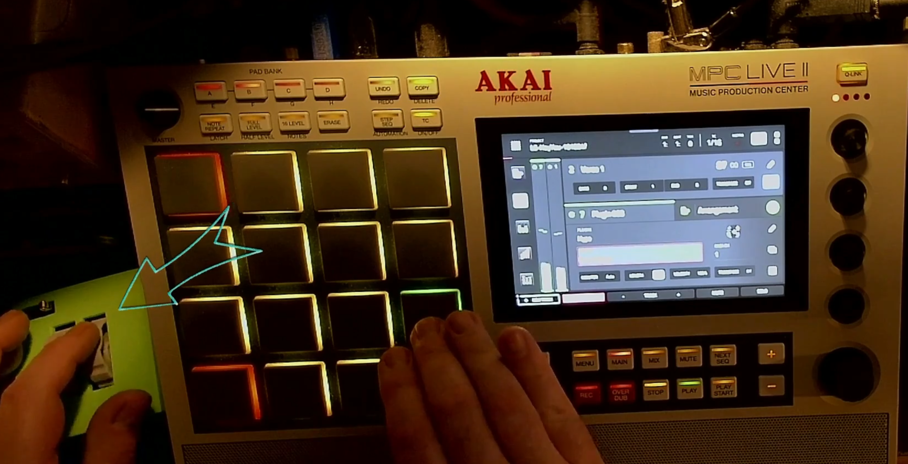
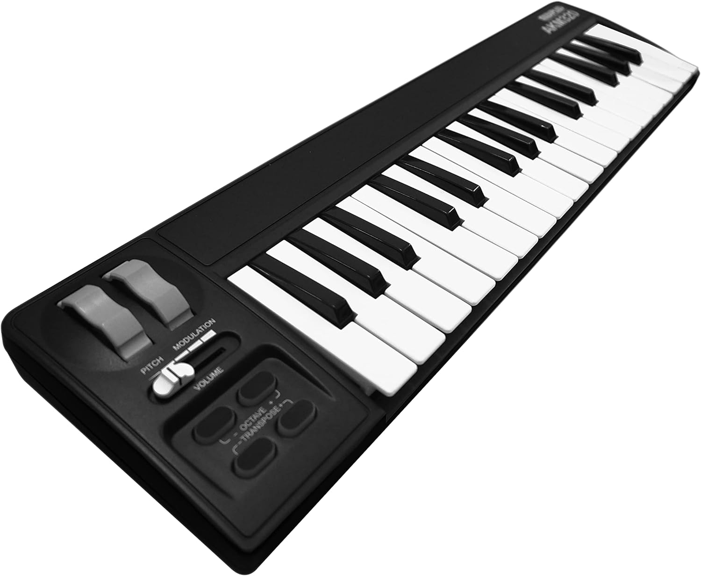
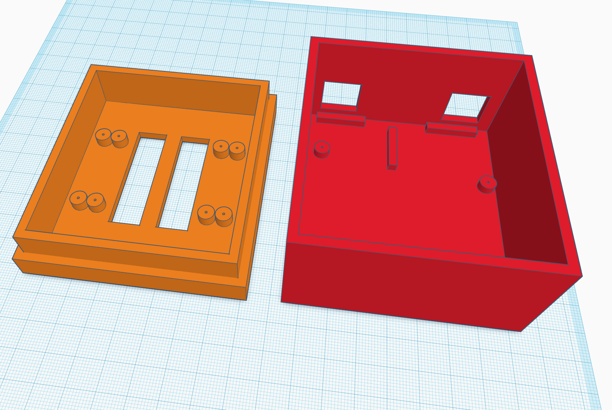
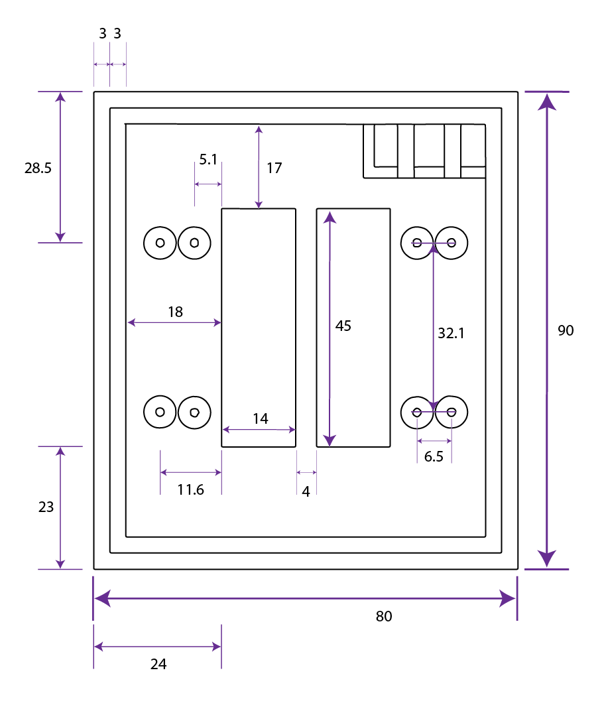
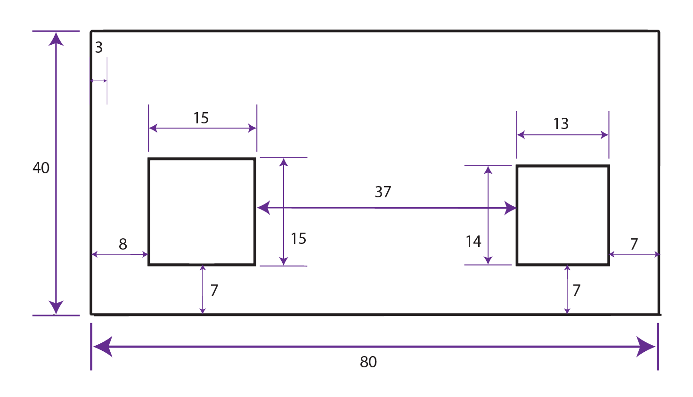

## ModPit Wheel Box USB MIDI Controller

<link rel="stylesheet" type="text/css" href="css/github.css"> 
 
<h1 align="center"> 
  
</h1> 

Build your own modulation and pitch bend wheels into a small box for use where space is limited.  

## Table of contents:

* [ModPit Wheel Box](#modpit-wheel-box-usb-midi-controller) 
* [Table of Contents](#table-of-contents) 
* [Description](#description)
	* [Why?](#why)
* [Theory of Operation](#theory-of-operation) 
	* [Hardware Components](#hardware-components)
	* [Usage](#usage)
	* [Other Ideas](#other-ideas)
* [Build](#build)
* [Donations](#donations)

## Description:
[Table of Contents](#table-of-contents)

The "ModPit Wheel Box" is a class-compliant USB MIDI controller built in an afternoon with parts scavenged from a cheap MIDI keyboard from Amazon and **no soldering required**.  The most difficult part of the build is figuring out how to mount the parts into something small and useful.  But, I have designed and shared a STL files for a 3D printable box which fits everything perfectly.

There is no code involved, since the MIDI keyboard we use is ready to plug-n-play.

This page was created to share the STL files, some dimensional details, and future enhancements (such as soldering that switch in for sustain).  If you would like to just watch my complete step-by-step instructional and demonstration video, it is available here:

[Instructional Video](https://www.youtube.com/watch?v=xuyAQrHJCjk)

### Why?:

I produce mostly on the Akai MPC platform and quite enjoy how easily the 16 pads are tuned to any key making it quick and easy to keep musical ideas flowing.  I understand keyboard and some basic music theory, but not nearly enough to move quickly on one.  Also, space on my studio desk is very limited.

<h1 align="center"> 
  
</h1> 

While I cannot move quickly across a keyboard, I do quite enjoy the accenting possible with the pitch bend and modulation wheels (and sustain pedals - more on this later) they can provide.  So, I went searching for a MIDI capable dedicated wheel controller box and found only that others were looking for the same.  I began to wonder if I could make my own, and here we are.

## Theory of Operation:
[Table of Contents](#table-of-contents)

We will refer to the following diagram for this explanation:

<h1 align="center"> 
  
</h1> 

### Hardware Components:

You will need to purchase the following keyboard ($35USD at the time of this build):

https://www.amazon.com/dp/B00VHKMK64

<h1 align="center"> 
  
</h1> 

If it is no longer available when you read this, try searching for "MIDIPLUS AKM320 USB MIDI Keyboard Controller, Black, 32-key".   If you still have no luck, I would wager there are others that this is possible to build with.  You will just need to come up with your own project box or tin can or whatever for mounting.

Basically, we are taking out and re-mounting the following:
* Interface Board (Includes USB port and 1/4" sustain pedal jack)
* Controller Board (This converts the controller movement into MIDI and sends to the Interface Board.)
* Pitch Bend Wheel
* Modulation Wheel
* All screws used to hold the above down will be re-used, if you are printing my box design
* The USB cable is usable

That's it.  The shell and all keys and circuits and cables and pads and screws are not used for this and could possibly be used for other projects.   We will need to remove a couple groups of the plastic keys and some of the underlying circuit board in order to get the rainbow cable which connects the Controller Board to the Interface Board freed up.

<h1 align="center"> 
  
</h1> 

You will also need to either 3D print my custom box or come up with a project box or cigar box or tuna can or whatever else you might think will work for mounting and (most importantly) using all of this.  Here are the STD files which you can import into your slicer and 3D print:

[ModPitTop.stl](STL/ModPitTop.stl)

[ModPitBottom.stl](STL/ModPitBottom.stl)

You are of course totally free to modify those to fit your hand better, etc.  I kept it very basic.

### Usage:

Simply plug one end of the USB cable into the back of the ModPit and the other into a USB port on your DAW device.  You can now use and record MIDI note pitch bends and modulation changes, either live or after you've lain down some notes.

If you are going to use a sustain pedal via the 1/4" jack, you will need one that is capable of N.O. (Normally Open) operation to have an expected experience.

### Other Ideas:

I am currently working on clearing my electronics bench so that I can properly solder in a momentary switch into the sustain jack pads.  This switch will fit into the little cubby you see in the lid.  I am using the following switches from Amazon:

https://www.amazon.com/dp/B09NKYG5YQ

They currently cost $8USD for 10.  If this link does not work, try searching for "BOJACK Micro Limit Switch with Momentary Roller Lever Arm SPDT 1NO 1NC 3 Pins 5A 125 250VAC (Pack of 10 Pcs)".  Short of that, you may need to find your own and drill a new hole.

Using this switch, it appears as though the NO and C pins will be used for this.  

More details as I get this addition completed.

You could also add any easily-triggered N.O. momentary switch you like to the side, or top, or wherever it allows you to easily trigger it, if that is something you wish to also have control of in the same hand.

## Build:
[Table of Contents](#table-of-contents)

Please refer to the above YouTube video for complete instructions and a demonstration.

If you are going to build your own project box for this, the below section will detail all of the dimensions I found while making mine.  All dimensions are in millimeters (mm).

This is the top, from underneath:
<h1 align="center"> 
  
</h1> 

And the bottom, from the back:
<h1 align="center"> 
  
</h1> 

Just keep in mind that I made all walls 3mm in thickness.  Mind an measurements relative to that.   These should give you enough to figure out where to cut your holes, though.  I presume that you will be using brass mounting posts and screws, so I did not bother giving the exact mounting hole widths, post heights, etc.

I hope this helps!  

## Donations:
[Table of Contents](#table-of-contents)

Donations accepted.  You can buy me a coffee here: 

https://buymeacoffee.com/sixthlevel
